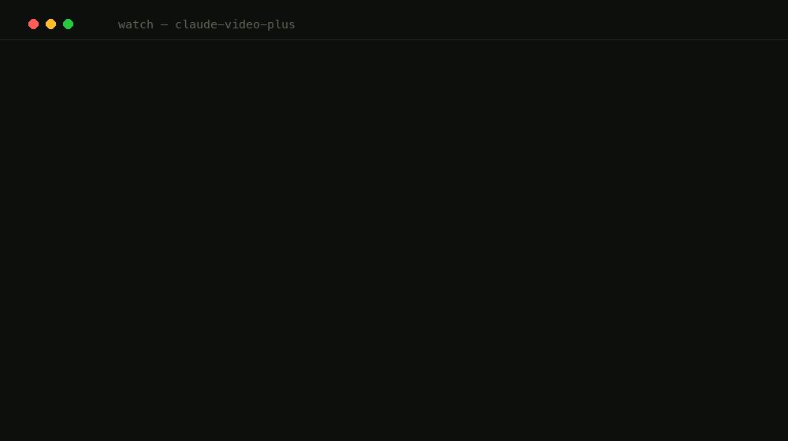

# /watch: claude-video-plus

**Same answer quality. Half the tokens. Faster than the default.**

Ask a video a question and `/watch` fetches only the evidence that answers it. In a sealed, receipt-gated benchmark on five videos it had never seen, evidence mode matched the original's blind-judged answer quality (8.83 vs 8.80) while sending the AI **56% less material**, and it ran **~14 seconds faster** end-to-end than the default mode. Zero risk to adopt: it only runs when you ask a question, and on any problem (no captions, local file, short video, any error) it runs the original pipeline instead.

<p align="center">
  
</p>

> [!NOTE]
> This is a fork of Brad Bonanno's [bradautomates/claude-video](https://github.com/bradautomates/claude-video), not the original repository. Upstream history, MIT license, and authorship are preserved; see [Gratitude](#gratitude-and-attribution).

[](https://github.com/abe238/claude-video-plus/releases/latest)
[](https://github.com/abe238/claude-video-plus/actions/workflows/tests.yml)
[](LICENSE)
[](https://github.com/abe238/claude-video-plus/releases/latest)

**Website:** [abe238.github.io/claude-video-plus](https://abe238.github.io/claude-video-plus/) · **Guide:** [Ask Claude to watch a video](https://abe238.github.io/claude-video-plus/watch-videos-with-claude.html) · **All benchmark data:** [docs/benchmarks/](docs/benchmarks/) · **Changelog:** [CHANGELOG.md](CHANGELOG.md) · **Status:** stable, deterministic suite on a hosted macOS/Linux matrix, isolated install lifecycle ([status page](docs/V1-STATUS.md))

<!-- The badges above are live. Do not hardcode a version number or a test count
     in this file or in docs/*.html — tests/test_no_hardcoded_version.py fails the
     build if you do. Per-release detail belongs in CHANGELOG.md. -->


## Install

Claude Code (recommended, auto-updates via marketplace):
```
/plugin marketplace add abe238/claude-video-plus
/plugin install watch@claude-video-plus
```

Codex, Cursor, Copilot, Gemini CLI, or any of 50+ [Agent Skills](https://agentskills.io) hosts:
```bash
npx skills add abe238/claude-video-plus -g
```

Zero config to start: `yt-dlp` and `ffmpeg` install on first run via `brew` on macOS (Linux/Windows print exact commands). Captions cover most public videos for free.

**No API key required, and none is asked for.** When a video has no captions, transcription falls to the local backends first — a loopback STT server, YAP on macOS, or the `openai-whisper` CLI on any platform — and audio never leaves your machine. Cloud Whisper exists but is doubly opt-in: a key alone does nothing without `--allow-remote-transcription`.

## The numbers

The sealed confirmatory run: five videos the pipeline had never seen, ten questions and answer keys frozen by two independent annotators before any pipeline ran, three blind judges per video, and a one-time cryptographic receipt so the run cannot be quietly repeated. [Raw data](docs/benchmarks/2026-07-12-confirmatory/).

| Result | Original | Evidence mode |
|---|---|---|
| Blind answer quality (1–10) | 8.80 | **8.83, same quality** |
| Required facts covered | 3.57 | **3.67, same coverage** |
| Material sent to the AI | 100% | **44% (56% less)** |
| Cold end-to-end wall time | 32–34 s | **18–19 s ([measured](docs/benchmarks/2026-07-12-performance/))** |

Development data tells the same story with more spread: 60–88% savings on targeted questions, wins concentrated on videos over 9 minutes, and every loss published unedited ([deep-dive](docs/benchmarks/2026-07-11-single-video-deep-dive/), [battery](docs/benchmarks/2026-07-12-multi-video-battery/)).

## How evidence mode works

```
/watch <url> --detail evidence --question "what's actually new, skip the hype?"
```

The original samples the whole timeline (50–100 frames plus the full transcript) no matter what you asked: ~50k tokens on a 40-minute video. Evidence mode retrieves instead: whole topical chapters (YouTube chapters, pause-gap fallback), a numeric guard that rescues pricing/benchmark/spec lines from anywhere in the video with a frame at each (numbers live on-screen), frames at chapter starts and "as you can see" moments, and a token budget. Every selection lands in a manifest with its timestamp, reason, and score, so you can audit exactly what the model saw and why.

Two reader rules proven out in blind judging ship in the skill contract: mine on-screen tables from frames (content nobody reads aloud), and reconcile conflicting claims (the judges credited this fork for catching a pricing self-contradiction the original repeated).

Everything upstream still works: the four original detail modes, `--start`/`--end` ranges, `--timestamps` cues, Whisper fallback, frame dedup. No question, no evidence mode.

## Tradeoffs, directly

- **Needs a question.** Without `--question`, the original path runs. Opt-in per invocation.
- **Auto-reverts on any problem.** No captions, local files, videos under 9 minutes (measured: evidence mode loses there), or any internal error: the original pipeline runs. There is no failure mode where you get less than the original.
- **Summaries keep the full transcript by design.** Top-k retrieval on a summary question is how you miss stories. The transcript is collapsed losslessly (YouTube rolling-caption overlap stripped: 43% fewer transcript tokens on a 43-minute video, every spoken line still present), and further summary savings come from smarter frame selection.
- **Retrieval is lexical (tf-idf plus guards), not semantic.** A question with zero word overlap with the video can under-retrieve. Optional local/remote semantic reranking exists; nothing transmits without explicit authorization.
- **Transcription is local-first, and cloud is doubly explicit.** Every local backend is exhausted before anything leaves the machine: captions, then a same-name `.vtt`/`.srt` sidecar, then a loopback STT server on `:8082`, then YAP on macOS, then the `openai-whisper` CLI on any platform. All are detected, never installed. Groq/OpenAI need both a key *and* `--allow-remote-transcription` — a key on its own transmits nothing. OpenCV is not included (its prototype measured worse; [ablation](docs/benchmarks/2026-07-11-opencv-ablation/)).
- **Media-derived text is treated as hostile — on every surface, not just the transcript.** The description, title, uploader, chapter titles, and transcript are all author-controlled, so they are neutralized before the model reads them: they cannot forge the report's untrusted-evidence markers (matched loosely, so a spacing tweak doesn't slip through), escape its code fences, or hide behind exotic line terminators. Of the six video skills we code-reviewed in July 2026, only one other ([claude-real-video](https://github.com/HUANGCHIHHUNGLeo/claude-real-video), transcript-only) treats video text as an injection surface at all. Don't take our word for it: [run the fixture against any tool, including ours](docs/does-your-video-skill-pass-this.md). The description is bounded, labeled, and never authoritative for what *happens* in the video — only for what the author published (exact spellings, their own links).
- **The full video still downloads for frame modes** (same as upstream). Range downloads are planned, not shipped.
- **Judges are AIs and the sample is modest.** Repeatability-validated (max 1-point drift), blinding hardened after an adversarial audit, answer keys frozen by two independent model annotators (owner-approved in place of two humans). Real, auditable measurements, not a large-scale trial.

## Usage

```
/watch https://youtu.be/dQw4w9WgXcQ what happens at the 30 second mark?
/watch https://www.tiktok.com/@user/video/123 summarize this
/watch ~/Movies/screen-recording.mp4 when does the UI break?
/watch "$URL" --detail evidence --question "what did they say about pricing?"
/watch https://youtu.be/abc --start 2:15 --end 2:45
```

Knobs (passed to `scripts/watch.py`):

- `--detail transcript|efficient|balanced|token-burner|evidence`, fidelity/speed dial; `evidence` requires `--question`.
- `--question "…"`, your question, verbatim; drives evidence-mode selection.
- `--timestamps T1,T2,…`, grab a frame at each absolute timestamp.
- `--max-frames N` / `--resolution W` / `--fps F`, budget and fidelity overrides.
- `--stt auto|sidecar|local-http|yap|whisper-cli|groq|openai`, pick a transcription backend; `auto` tries every local one before cloud.
- `--allow-remote-transcription`, required before any audio may go to Groq/OpenAI. Without it, a key is inert.
- `--no-whisper`, skip transcription entirely (frames only).
- `--no-description`, omit the author-supplied description from the report.
- `--no-dedup`, keep near-duplicate frames.
- `--out-dir DIR`, keep working files somewhere specific.

## How it works

1. You paste a video and a question: URL (anything yt-dlp supports) or local path.
2. `yt-dlp` checks captions first; at `transcript` detail, captioned URLs return without downloading video.
3. Frames extract at the chosen detail. Original modes sample the timeline; `evidence` selects per question (chapters → spans → tf-idf + facet expansion → numeric guard → sufficiency check → chapter/cue/guard frames).
4. Transcript from captions, falling back through every local backend (sidecar → loopback `:8082` → YAP → `openai-whisper` CLI) before cloud is even considered. The author's description is read too, bounded and labeled untrusted: speech recognition cannot spell a name it has never heard, so links, repos, and product names come from there while the video stays authoritative for what happens.
5. Frames plus transcript (or evidence manifest) go to the model, which Reads every frame as an image, mines on-screen tables, and reconciles conflicts.
6. The model answers grounded in what's on screen and in the audio, citing timestamps.

## More install options

| Surface | Install |
|---------|---------|
| **Claude Code** | `/plugin marketplace add abe238/claude-video-plus` then `/plugin install watch@claude-video-plus` |
| **Codex, Cursor, Copilot, Gemini CLI, +50 more** | `npx skills add abe238/claude-video-plus -g` |
| **claude.ai** (web) | Download [`watch.skill`](https://github.com/abe238/claude-video-plus/releases/latest/download/watch.skill) → Settings → Capabilities → Skills → `+` |
| **Manual / dev** | `git clone https://github.com/abe238/claude-video-plus.git && ln -s "$(pwd)/claude-video-plus/skills/watch" ~/.claude/skills/watch` |

Update later with `/plugin update watch@claude-video-plus` or `npx skills update watch -g`.

## Structure

```
.
├── skills/watch/                 # self-contained skill, this is the whole install package
│   ├── SKILL.md                  # skill contract, source of truth across all hosts
│   └── scripts/                  # watch.py, evidence.py, download/frames/transcribe/whisper/setup/config
├── docs/benchmarks/              # supplemental evidence data (NOT in the install package)
├── docs/plans/                   # canonical v1 master plan plus historical review records
├── tests/                        # deterministic pytest suite
└── .claude-plugin/ .codex-plugin/ .agents/   # host manifests
```

## Develop

```bash
python3 -m pytest -q                          # full deterministic suite
bash skills/watch/scripts/build-skill.sh      # → dist/watch.skill (requires clean tree)
./dev-sync.sh                                 # mirror working tree into installed plugin cache
```

## Gratitude and attribution

This fork exists because **Brad Bonanno** ([@bradautomates](https://github.com/bradautomates)) built and openly shared [claude-video](https://github.com/bradautomates/claude-video): a genuinely reliable foundation whose design decisions (caption-first, self-contained skill folder, fail-open everything) this fork inherits wholesale. The upstream Git history, MIT license, and original authorship are intentionally preserved. Brad makes content about building with AI on [YouTube](https://www.youtube.com/@bradbonanno), check him out.

We also appreciate the maintainers whose tools make the runtime possible:

- [FFmpeg/FFmpeg](https://github.com/FFmpeg/FFmpeg) and [yt-dlp/yt-dlp](https://github.com/yt-dlp/yt-dlp), the entire media layer
- Whisper transcription via [Groq](https://groq.com) or [OpenAI](https://openai.com)

The evidence-mode design draws on published research (VideoTree, Adaptive Keyframe Sampling, PixelRAG, and others).

We are also grateful to the fork authors whose public work helped us identify mechanisms worth evaluating for v1.0. Credit here records design influence and evaluation provenance; it does **not** claim their source code or every listed feature currently ships. If a mechanism is promoted, its exact origin, revision, license, modifications, and release-note credit must be recorded first.

- [`taeloautomates/claude-video`](https://github.com/taeloautomates/claude-video), YouTube SABR/client and cookie-resilience concept.
- [`thedirektor/claude-video`](https://github.com/thedirektor/claude-video), classified acquisition retries, focused transcription, resume/cache, OCR, and testing ideas.
- [`RadoslavSheytanov/claude-video`](https://github.com/RadoslavSheytanov/claude-video), caption-coverage and Whisper-reliability ideas.
- [`Tigertycoon/claude-video`](https://github.com/Tigertycoon/claude-video) and [`manojbadam/claude-video`](https://github.com/manojbadam/claude-video), sidecar-first transcript ideas.
- [`CJNA/claude-video`](https://github.com/CJNA/claude-video), Fathom source exploration, deferred from v1.0.
- [`sciencemj/claude-video-local`](https://github.com/sciencemj/claude-video-local), local transcription and portable-bundle architecture.
- [`troyshelton/claude-video`](https://github.com/troyshelton/claude-video), [`jsstn/claude-video`](https://github.com/jsstn/claude-video), and [`danielfrey63/claude-video`](https://github.com/danielfrey63/claude-video), local and pluggable transcription patterns.
- [`joweiser/claude-video`](https://github.com/joweiser/claude-video) and [`JoseBallestas/claude-video`](https://github.com/JoseBallestas/claude-video), silence-aware chunks, focused transcription, bounded retries, and diagnostics.
- [`finnvoor/yap`](https://github.com/finnvoor/yap) and the faster-whisper server ecosystem, optional local transcription references; neither is automatically installed.
- [`DanielZYoffe/claude-video-lite`](https://github.com/DanielZYoffe/claude-video-lite), PySceneDetect reference evaluated in the documented OpenCV ablation; that Adapter was rejected for v1.0.

The canonical mechanism-by-mechanism disposition is maintained in [PROVENANCE.md](docs/execution/v1/PROVENANCE.md).

## License

MIT, see [LICENSE](LICENSE). Original work © Brad Bonanno; derivative changes © Abe Diaz.
